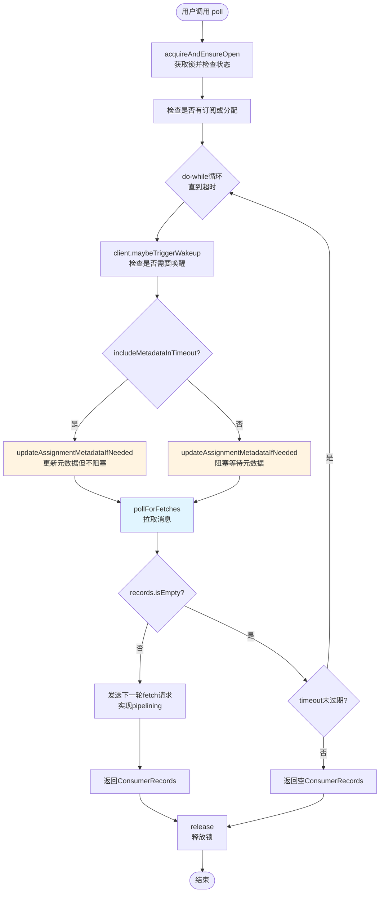
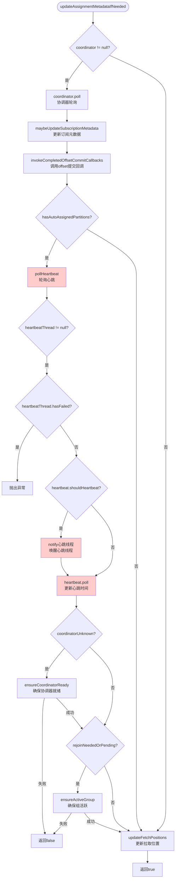
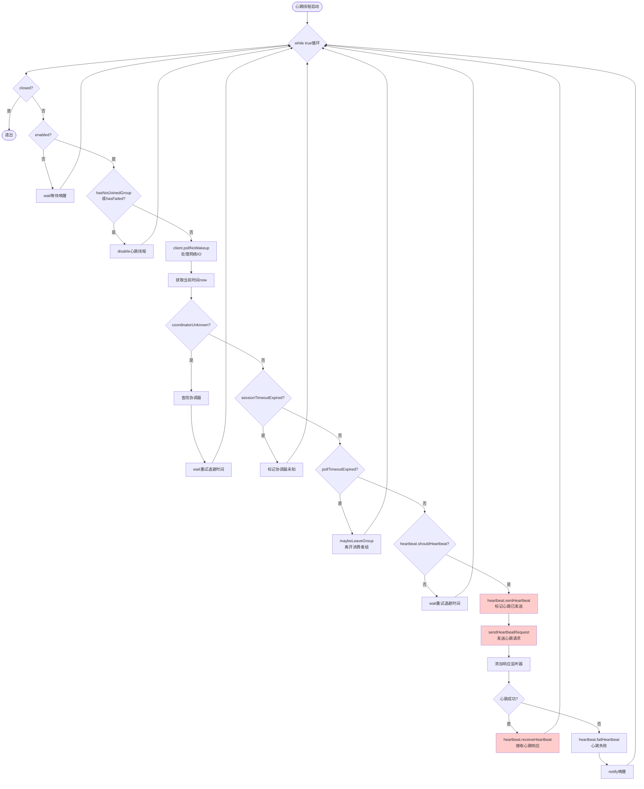
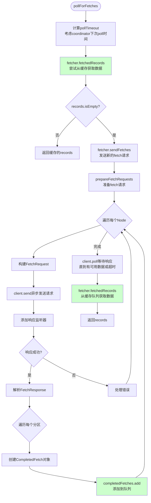
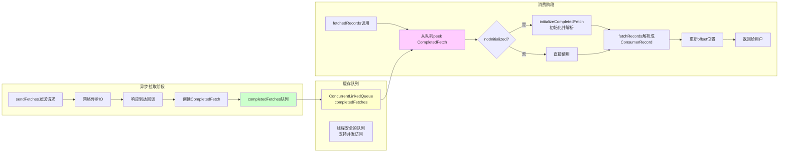
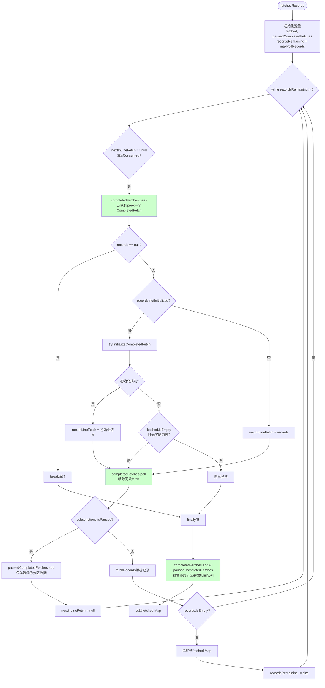
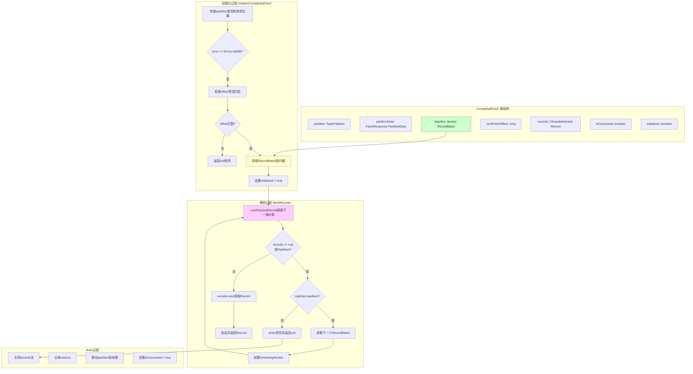

# KafkaConsumer poll() 方法全链路流程图

## 1. poll() 方法主流程

## 2. updateAssignmentMetadataIfNeeded 详细流程（包含心跳）

## 3. 心跳线程工作机制

## 4. pollForFetches 详细流程（包含CompletedFetch机制）

## 5. CompletedFetch 异步拉取和缓存机制详解

## 6. fetchedRecords 详细处理流程

## 7. CompletedFetch 内部结构和工作原理

## 核心机制总结

### 1. 心跳机制
- **触发时机**: 在 `coordinator.poll()` 中通过 `pollHeartbeat()` 唤醒心跳线程
- **心跳线程**: 独立的后台线程，持续运行
- **发送逻辑**: 
  - 心跳线程检查 `heartbeat.shouldHeartbeat(now)` 
  - 如果到了心跳间隔时间，调用 `sendHeartbeatRequest()` 发送
  - 通过 `RequestFuture` 异步发送，响应通过监听器处理
- **关键点**: 
  - 心跳线程和主poll线程是分离的
  - 心跳失败会触发重试或离开组
  - 如果 `max.poll.interval.ms` 超时，心跳线程会主动离开组

### 2. CompletedFetch 异步拉取和缓存机制
- **异步拉取**: 
  - `sendFetches()` 异步发送 FetchRequest，不阻塞
  - 响应通过回调处理，创建 `CompletedFetch` 对象
  - `CompletedFetch` 被添加到 `completedFetches` 队列（`ConcurrentLinkedQueue`）
  
- **缓存机制**:
  - `completedFetches` 是线程安全的队列，支持并发访问
  - 响应可能在后台线程（如心跳线程）处理，添加到队列
  - 主线程调用 `fetchedRecords()` 时从队列取出数据
  
- **延迟解析**:
  - `CompletedFetch` 保存原始的 `FetchResponse.PartitionData` 和 `RecordBatch` 迭代器
  - 只有在 `fetchedRecords()` 时才真正解析成 `ConsumerRecord`
  - 通过 `nextInLineFetch` 缓存当前正在处理的 `CompletedFetch`
  
- **优势**:
  - **Pipelining**: 在返回当前批次数据前，可以发送下一轮fetch请求
  - **非阻塞**: 主线程不需要等待网络IO完成
  - **批量处理**: 一次fetch响应可能包含多个分区的数据，分批返回给用户

