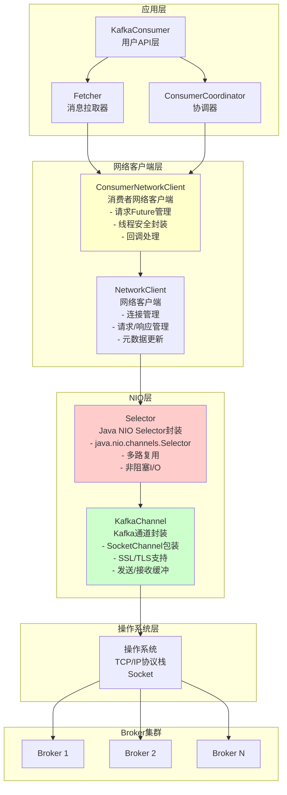
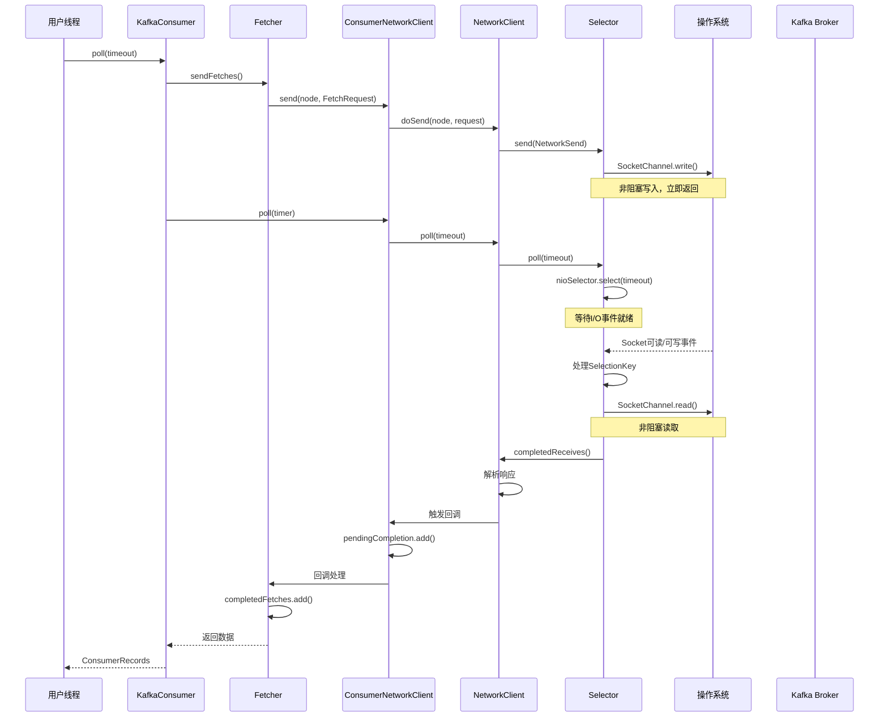
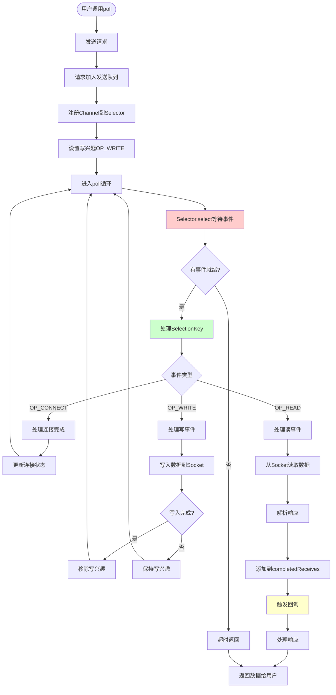
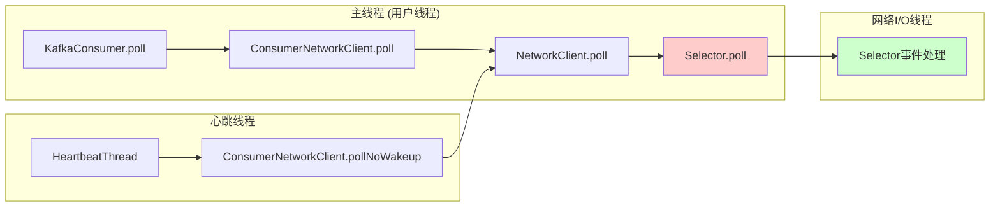

# KafkaConsumer 网络 I/O 模型详解

## 概述

KafkaConsumer 使用 **Java NIO (Non-blocking I/O)** 实现异步非阻塞的网络 I/O 模型。整个网络架构采用分层设计，从底层到上层依次为：

1. **Selector** - 基于 Java NIO Selector 的异步非阻塞 I/O 层
2. **NetworkClient** - 网络连接和请求管理
3. **ConsumerNetworkClient** - 消费者专用的网络客户端封装
4. **KafkaConsumer** - 最上层的消费者 API

## 网络 I/O 架构图



## 详细组件说明

### 1. Selector (NIO 核心层)

**位置**: `org.apache.kafka.common.network.Selector`

**核心特性**:
- 基于 `java.nio.channels.Selector` 实现
- 单线程处理多个连接（多路复用）
- 非阻塞 I/O 操作
- 支持 SSL/TLS 加密

**关键组件**:
```java
private final java.nio.channels.Selector nioSelector;  // Java NIO Selector
private final Map<String, KafkaChannel> channels;      // 连接通道映射
private final List<NetworkSend> completedSends;        // 已完成的发送
private final LinkedHashMap<String, NetworkReceive> completedReceives; // 已完成的接收
```

**工作流程**:
1. 注册多个 `SocketChannel` 到 `nioSelector`
2. 调用 `nioSelector.select(timeout)` 等待 I/O 事件
3. 处理就绪的 `SelectionKey`（连接、读、写事件）
4. 将完成的发送/接收放入相应列表

### 2. NetworkClient (网络连接管理)

**位置**: `org.apache.kafka.clients.NetworkClient`

**职责**:
- 管理到各个 Broker 的连接状态
- 维护请求队列和响应处理
- 处理连接重试和超时
- 更新元数据

**关键组件**:
```java
private final Selectable selector;                    // Selector引用
private final ClusterConnectionStates connectionStates; // 连接状态
private final InFlightRequests inFlightRequests;     // 飞行中的请求
```

### 3. ConsumerNetworkClient (消费者网络封装)

**位置**: `org.apache.kafka.clients.consumer.internals.ConsumerNetworkClient`

**职责**:
- 提供线程安全的网络操作接口
- 管理请求 Future 和回调
- 处理请求完成通知
- 支持条件阻塞（PollCondition）

**关键特性**:
- 线程安全（使用 ReentrantLock）
- 异步请求发送，通过 Future 获取结果
- 回调在独立队列中执行，避免死锁

### 4. KafkaConsumer (应用层)

**位置**: `org.apache.kafka.clients.consumer.KafkaConsumer`

**职责**:
- 提供用户 API
- 协调 Fetcher 和 Coordinator
- 管理订阅和分区分配

## 网络 I/O 流程图



## 异步非阻塞 I/O 详细流程



## 关键机制详解

### 1. 多路复用 (Multiplexing)

**原理**: 单个线程通过 `Selector` 管理多个连接

```java
// Selector 内部维护多个 KafkaChannel
private final Map<String, KafkaChannel> channels;

// 所有 Channel 注册到同一个 nioSelector
private final java.nio.channels.Selector nioSelector;

// 一次 select() 可以检测多个 Channel 的 I/O 事件
int numReadyKeys = nioSelector.select(timeout);
Set<SelectionKey> readyKeys = nioSelector.selectedKeys();
```

**优势**:
- 单线程处理多个连接，减少线程切换开销
- 非阻塞 I/O，避免线程阻塞
- 高并发支持，可同时管理数百个连接

### 2. 异步请求处理

**请求发送**:
```java
// ConsumerNetworkClient.send() - 立即返回 Future
RequestFuture<ClientResponse> future = client.send(node, requestBuilder);

// 请求被加入队列，等待 poll() 时发送
// 不阻塞，立即返回
```

**响应处理**:
```java
// 响应通过回调处理
future.addListener(new RequestFutureListener<ClientResponse>() {
    @Override
    public void onSuccess(ClientResponse resp) {
        // 处理响应（可能在后台线程）
    }
});
```

### 3. 事件驱动模型

**事件类型**:
- `OP_CONNECT`: 连接建立完成
- `OP_READ`: Socket 可读
- `OP_WRITE`: Socket 可写

**事件处理**:
```java
// Selector.poll() 处理事件
if (key.isConnectable()) {
    channel.finishConnect();  // 完成连接
}
if (key.isReadable()) {
    channel.read();  // 读取数据
}
if (key.isWritable()) {
    channel.write();  // 写入数据
}
```

### 4. 内存管理

**发送缓冲**:
- `NetworkSend`: 封装待发送的数据
- 使用 `ByteBuffer` 管理内存
- 支持零拷贝优化

**接收缓冲**:
- `NetworkReceive`: 封装接收的数据
- 使用 `MemoryPool` 管理内存
- 防止内存溢出

## 线程模型



**关键点**:
- **主线程**: 执行用户代码和网络 I/O（单线程模型）
- **心跳线程**: 独立线程发送心跳，也调用 `poll()` 处理网络 I/O
- **Selector**: 单线程处理所有连接的 I/O 事件
- **线程安全**: `ConsumerNetworkClient` 使用锁保证线程安全

## 性能优化特性

### 1. 零拷贝 (Zero-Copy)
- 使用 `FileChannel.transferTo()` 直接传输数据
- 减少数据拷贝次数

### 2. 批量处理
- 一次 `poll()` 处理多个请求/响应
- 减少系统调用次数

### 3. 连接复用
- 维护到各个 Broker 的长连接
- 避免频繁建立/关闭连接

### 4. 背压控制
- `max.in.flight.requests.per.connection` 限制飞行中的请求数
- 防止内存溢出

## 与阻塞 I/O 的对比

| 特性 | 阻塞 I/O | NIO (KafkaConsumer) |
|------|---------|---------------------|
| 线程模型 | 一个连接一个线程 | 单线程多路复用 |
| 阻塞 | 读写操作阻塞线程 | 非阻塞，立即返回 |
| 并发能力 | 受线程数限制 | 可处理大量连接 |
| 资源消耗 | 高（线程栈内存） | 低（单线程） |
| 复杂度 | 简单 | 较复杂（事件驱动） |

## 总结

KafkaConsumer 的网络 I/O 模型是典型的 **Reactor 模式**实现：

1. **单线程事件循环**: `Selector.poll()` 在单线程中处理所有 I/O 事件
2. **非阻塞 I/O**: 所有网络操作都是非阻塞的，立即返回
3. **事件驱动**: 基于 I/O 事件（连接、读、写）驱动处理流程
4. **异步回调**: 请求发送后立即返回，响应通过回调处理

这种设计使得 KafkaConsumer 能够：
- 高效处理大量并发连接
- 低延迟响应网络事件
- 资源占用少（单线程模型）
- 支持高吞吐量数据传输

